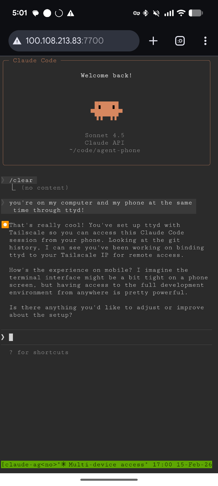
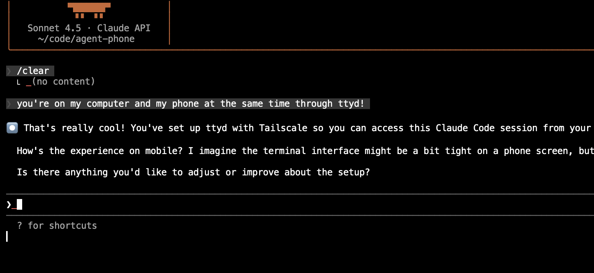

# agent-to-go

A minimal, security-conscious way to access terminal sessions from your phone's browser. Works with Claude Code, Codex, aider, or any CLI tool.

No bells and whistles — just a session picker, a reverse proxy to ttyd, and layered defenses against browser-based attacks (CSRF, DNS rebinding, clickjacking, origin validation). See [SECURITY.md](SECURITY.md) for the full threat model.

**Warning:** This allows your phone to control your computer through your Tailnet. Review the code and security model if you're nervous. Consider running on a dedicated coding VM rather than a machine with important secrets.

<p>



</p>

## How it works

1. Alias your command to run inside tmux (e.g., `alias claude='agent-tmux claude'`)
2. Run `agent-to-go` on your server - it lists all tmux sessions on a web page
3. Open the picker from your phone and tap a session to connect
4. Full terminal in your phone browser - same session as your computer

## Requirements

- [tmux](https://github.com/tmux/tmux)
- [ttyd](https://github.com/tsl0922/ttyd)
- [Tailscale](https://tailscale.com) (for secure access from phone)
- Go (to build)

## Install

```bash
# Install dependencies
# macOS
brew install tmux ttyd tailscale

# NixOS
nix-shell -p tmux ttyd tailscale

# Ubuntu/Debian
apt install tmux
# ttyd: see https://github.com/tsl0922/ttyd#installation

# Build the picker
go build -o agent-to-go .

# Copy agent-tmux to your PATH
cp agent-tmux ~/.local/bin/
chmod +x ~/.local/bin/agent-tmux
```

Make sure `~/.local/bin` is in your PATH. Add to `~/.bashrc` or `~/.zshrc`:

```bash
export PATH="$HOME/.local/bin:$PATH"
```

## Setup

### 1. Configure aliases

Add to your shell config (`~/.bashrc`, `~/.zshrc`, etc.):

```bash
alias claude='agent-tmux claude'
alias codex='agent-tmux codex'
alias aider='agent-tmux aider'
# any other CLI tools you want phone access to
```

Now every `claude` command runs in a tmux session with a name like `claude-myproject-swift-oak`.

### 2. Start the picker

Run on your server/computer (the machine where you run your CLI tools):

```bash
./agent-to-go
```

It binds to port 8090 on your Tailscale IP. You'll see output like:

```
agent-to-go running at: http://100.x.x.x:8090
```

### 3. Connect from phone

1. Make sure your phone is on Tailscale
2. Open `http://<tailscale-ip>:8090` in your phone browser
3. You'll see a list of tmux sessions
4. Tap a session to connect

### Running as a service (optional)

To keep agent-to-go running after logout, create a systemd service:

```bash
# ~/.config/systemd/user/agent-to-go.service
[Unit]
Description=agent-to-go - tmux session picker
After=network.target tailscaled.service

[Service]
ExecStart=/path/to/agent-to-go
Restart=always

[Install]
WantedBy=default.target
```

Then:

```bash
systemctl --user enable agent-to-go
systemctl --user start agent-to-go
```

## How agent-tmux works

When you run `agent-tmux claude`:

1. Generates a unique session name: `claude-<project>-<adjective>-<noun>`
2. Creates a new tmux session running your command
3. Attaches you to that session

If you're already inside tmux, it creates a detached session and switches to it.

## Security

**Assumptions:**

- **Single-user Tailnet** - Anyone on your Tailnet gets full terminal access. There's no authentication beyond "can reach the Tailscale IP". Don't use this if you share your Tailnet with others.
- **Tailscale is running** - The server refuses to start without it (fail-closed). Tailscale provides encryption (WireGuard) and network-level access control.

**What's protected:**

- Server bound to Tailscale IP only (refuses to start if Tailscale unavailable)
- ttyd instances bound to localhost, accessed via reverse proxy
- CSRF tokens on all state-changing endpoints
- Host header validation blocks DNS rebinding attacks
- Origin validation blocks cross-origin POST requests
- Command/directory allowlists for spawning sessions
- Orphaned ttyd processes cleaned up automatically

See [SECURITY.md](SECURITY.md) for the full security model.

**What's NOT protected:**

- No auth within Tailnet (Tailnet access = full terminal access)
- No HTTPS (relies on Tailscale's WireGuard encryption)

## Architecture

```
┌─────────────────────────────────────────────────────────────────┐
│                       Your Computer                             │
│                                                                 │
│  ┌─────────────┐     ┌─────────────┐     ┌─────────────┐       │
│  │   tmux      │     │   tmux      │     │   tmux      │       │
│  │  session 1  │     │  session 2  │     │  session 3  │       │
│  │ (claude)    │     │ (claude)    │     │ (aider)     │       │
│  └──────▲──────┘     └──────▲──────┘     └─────────────┘       │
│         │                   │                                   │
│         │ attach            │ attach                            │
│         │                   │                                   │
│  ┌──────┴──────┐     ┌──────┴──────┐                           │
│  │    ttyd     │     │    ttyd     │  (spawned on demand)      │
│  │  127.0.0.1  │     │  127.0.0.1  │  (localhost only)        │
│  └──────▲──────┘     └──────▲──────┘                           │
│         │                   │                                   │
│         └────────┬──────────┘                                   │
│                  │ reverse proxy                                │
│           ┌──────┴──────┐                                       │
│           │ agent-to-go │  HTTP server                          │
│           │    :8090    │  - lists sessions                     │
│           │             │  - reverse proxies ttyd               │
│           └──────▲──────┘  - Host header validation             │
│                  │                                              │
│                  │ bound to Tailscale IP only                   │
└──────────────────┼──────────────────────────────────────────────┘
                   │
                   │ WireGuard encrypted tunnel
                   │
┌──────────────────┼──────────────────────────────────────────────┐
│    Tailscale     │                                              │
│    Network       │                                              │
└──────────────────┼──────────────────────────────────────────────┘
                   │
                   │
            ┌──────┴──────┐
            │   Phone     │
            │  (browser)  │
            └─────────────┘
```

| Component | Role |
|-----------|------|
| **tmux** | Persistent terminal sessions that survive disconnects |
| **ttyd** | Web server that exposes a terminal in a browser |
| **agent-to-go** | Glue: lists sessions, spawns ttyd, handles routing |
| **Tailscale** | Encrypted network, access control (only your devices) |
| **agent-tmux** | Wrapper to create uniquely-named tmux sessions |

## Troubleshooting

See [TROUBLESHOOTING.md](TROUBLESHOOTING.md).

## License

MIT
